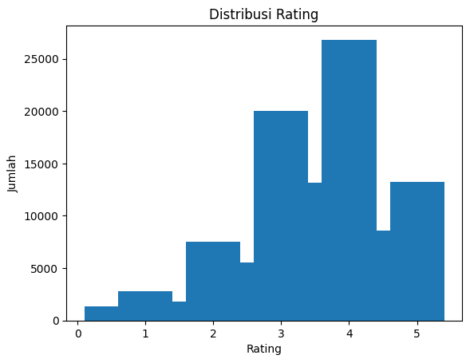
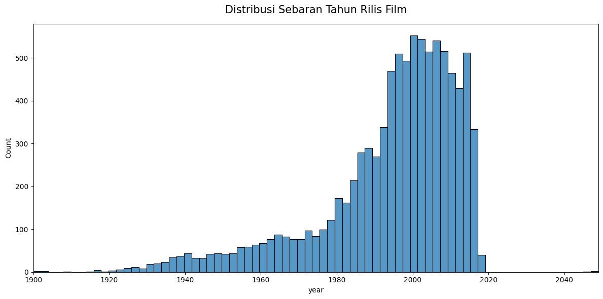
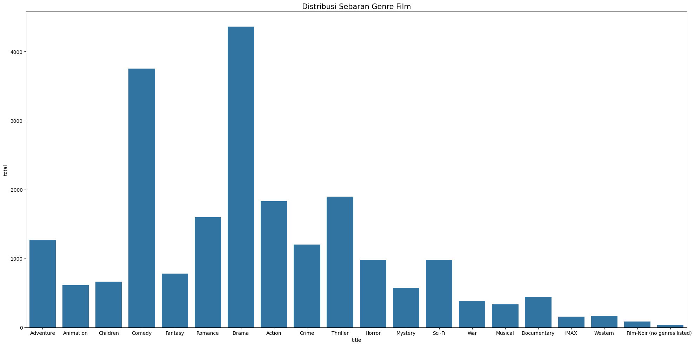
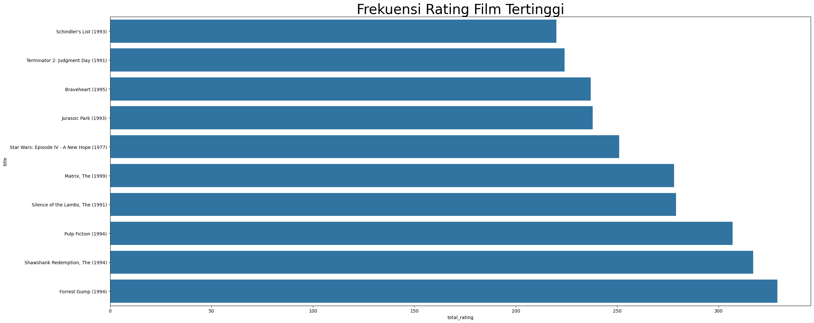
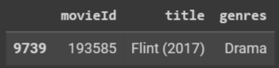
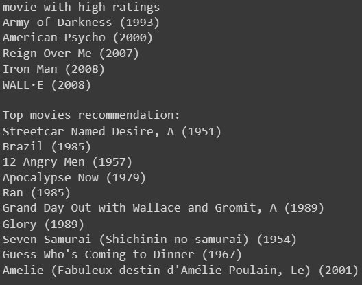
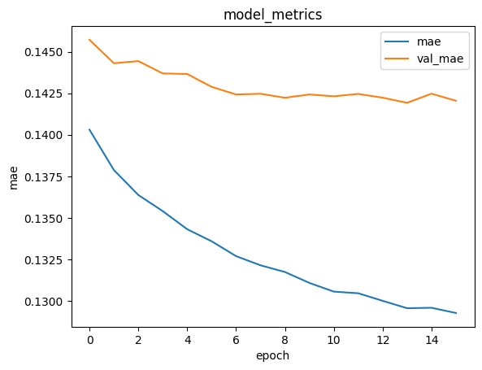
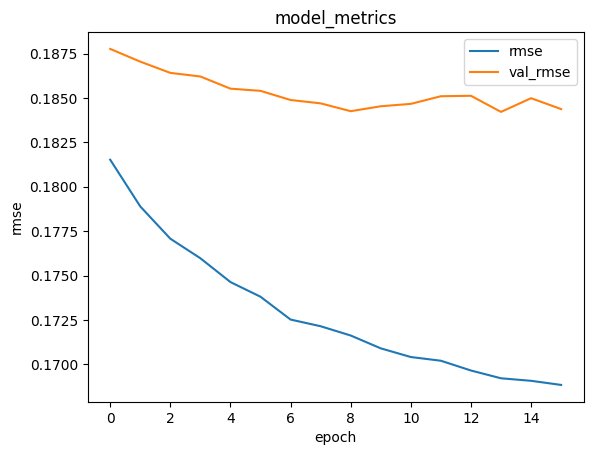

# Laporan Proyek _Machine Learning_ - Moch. Avin

# Project Overview

Dalam era digital saat ini, di mana akses terhadap konten multimedia semakin meluas, pengguna sering kali dihadapkan pada masalah kelebihan informasi, terutama ketika memilih film yang sesuai dengan preferensi mereka. Oleh karena itu, **sistem rekomendasi film** menjadi sangat relevan dalam upaya menyajikan pengalaman yang lebih personal dan memuaskan bagi pengguna [1].

Dengan memanfaatkan teknik seperti:

- _Content Based Filtering_ [3]
- _Collaborative Filtering_ [2]

Proyek ini penting karena:

1. **Pengalaman Pengguna**: Memastikan pengguna dapat dengan mudah menemukan film sesuai preferensi mereka. [2]

2. **Mengatasi Kelebihan Informasi**: Menawarkan solusi atas masalah kelebihan informasi di era digital.[1]

3. **Meningkatkan Interaksi**: Meningkatkan interaksi pengguna dengan platform multimedia.[3]

4. **Potensi Bisnis**: Memberikan peluang bisnis melalui peningkatan retensi pengguna dan pendapatan.[3]

# Business Understanding

Sistem rekomendasi merupakan sebuah aplikasi yang berfungsi untuk memberikan saran atau rekomendasi kepada pengguna dalam mengambil keputusan sesuai dengan preferensi mereka. Untuk meningkatkan pengalaman pengguna dalam menemukan film-film yang menarik dan sesuai dengan minat mereka, penerapan sistem rekomendasi menjadi pilihan yang tepat. Dengan adanya sistem rekomendasi, pengalaman pengguna akan lebih baik karena mereka dapat memperoleh rekomendasi judul film yang sesuai dengan harapan dan keinginan mereka.

### Problem Statement

Berdasarkan latar belakang yang telah dipaparkan, terdapat beberapa permasalahan yang perlu diselesaikan dalam proyek ini:

- Bagaimana melakukan proses pengolahan data dengan baik agar data tersebut dapat dimanfaatkan untuk membuat model sistem rekomendasi yang berkualitas?
- Bagaimana cara mengembangkan model machine learning yang mampu memberikan rekomendasi film yang kemungkinan besar akan disukai oleh pengguna?

### Goals

Tujuan dibuatnya proyek ini adalah sebagai berikut:

- Melakukan serangkaian proses pengolahan data dengan metode yang tepat sehingga data tersebut siap dimanfaatkan untuk membangun model sistem rekomendasi yang berkualitas dan akurat.
- Mengembangkan model machine learning yang mampu menganalisis pola dan preferensi pengguna, serta memberikan rekomendasi judul film yang kemungkinan besar akan diminati dan disukai oleh pengguna.

### Solution

Untuk mengatasi permasalahan ini, penulis akan mengimplementasikan dua pendekatan algoritma, yaitu _content-based filtering_ dan _collaborative filtering_. Berikut penjelasan dari kedua teknik tersebut:

- _Content-Based Filtering_ adalah metode untuk memberikan rekomendasi film kepada pengguna berdasarkan kemiripan genre atau fitur-fitur yang terdapat pada film-film yang telah disukai oleh pengguna tersebut di masa lalu. Pendekatan ini mempelajari profil preferensi pengguna baru dengan menganalisis data dari objek-objek (film) yang telah dinilai sebelumnya oleh pengguna.
- _Collaborative Filtering_ adalah metode untuk memberikan rekomendasi film kepada pengguna berdasarkan penilaian (_rating_) yang diberikan oleh komunitas pengguna lain dengan preferensi yang serupa. Pendekatan ini tidak memerlukan atribut atau fitur spesifik dari setiap film, melainkan menggunakan pola _rating_ yang diberikan oleh pengguna untuk menemukan kemiripan preferensi di antara mereka.

# Data Understanding

### Dataset

Proyek ini akan menggunakan dataset film dengan informasi genre dan rating. Dataset tersebut bersumber dari [Kaggle](https://www.kaggle.com/sunilgautam/movielens). Dataset ini masuk dalam kategori Movies & TV Shows dengan tingkat kegunaan (usability) sebesar 5.3. Dataset tersebut berbentuk file ZIP berukuran 3.3 MB yang berisi 4 file CSV.

Dataset ini berisi 4 file:

- links.csv
- ratings.csv
- movies.csv
- tags.csv

Dalam proyek ini, penulis hanya menggunakan 2 file dataset, yaitu:

1. _movies.csv_

   - _Jumlah Data: 9742, dengan 3 kolom_
     - `movieId`: ID dari film. Terdapat 9742 data unik.
     - `title`: Judul dari film. Terdapat 9737 data unik.
     - `genres`: Genre dari film. Terdapat 951 data unik.

2. _ratings.csv_
   - _Jumlah Data: 100836, dengan 4 kolom_
     - `userId`: ID pengguna pemberi rating. Terdapat 610 data unik.
     - `movieId`: ID film yang diberi rating. Terdapat 9724 data unik.
     - `rating`: Rating dari film. Terdapat 10 data unik dengan range 0 - 5 dan skala 0.5.
     - `timestamp`: Waktu rating terekam. Terdapat 85043 data unik.

### Exploratory Data Analysis

#### Distribusi Rating

| Rating | Count |
| ------ | ----- |
| 4.0    | 26818 |
| 3.0    | 20047 |
| 5.0    | 13211 |
| 3.5    | 13136 |
| 4.5    | 8551  |
| 2.0    | 7551  |
| 2.5    | 5550  |
| 1.0    | 2811  |
| 1.5    | 1791  |
| 0.5    | 1370  |

Terlihat sebaran ratings kelipatan 0.5 dengan rating terendah 0.5 dan rating tertinggi 5.0 dan rating user terbanyak adalah 4.0.

#### Distribusi Tahun Rilis

Berdasarkan grafik yang disajikan, dapat diamati bahwa rata-rata tahun rilis film berada dalam rentang 1990 hingga 2000-an ke atas. Distribusi terbanyak terjadi di atas tahun 2000, di mana jumlah film yang dirilis cenderung mengalami peningkatan yang signifikan seiring berjalannya waktu.

#### Distribusi Genre

Dari gambar yang ditampilkan, dapat dilihat bahwa terdapat 20 kategori atau genre dalam dataset ini. Genre yang paling banyak muncul adalah **Drama**, diikuti oleh genre **Comedy**. Selain itu, terdapat beberapa film yang tidak memiliki genre yang terdaftar, ditandai dengan keterangan **no genres listed**.

#### Film yang Memiliki Paling Banyak Rating

Terlihat bahwa film yang paling banyak dirating adalah **Forrest Gump(1994)** dengan lebih dari 300 rating.

# Data Preparation

_Data Preparation_ diperlukan untuk mempersiapkan data agar saat dilakukan proses pengembangan model, akurasi model dapat ditingkatkan dan meminimalisir terjadinya bias pada data. Tahapan-tahapan dalam melakukan _preprocessing_ data adalah sebagai berikut:

1. Penanganan **_missing value_** dilakukan dengan menghapus data yang memiliki nilai yang hilang. Dataset yang digunakan cukup bersih, sehingga _missing value_ hanya terjadi saat penggabungan dataset.
2. Data rating diurutkan berdasarkan ID pengguna untuk memudahkan penghapusan data duplikat selanjutnya.
3. **Penghapusan data duplikat** dilakukan untuk mencegah terjadinya bias pada data.
4. **Penggabungan data** yang telah diolah sebelumnya dilakukan untuk membangun model. Data yang memiliki _missing value_ pada variabel genre dihapus, dan setelah penggabungan, data memiliki 100.830 baris dengan 5 kolom.
5. **Normalisasi nilai rating** dilakukan untuk menghasilkan rekomendasi yang sesuai dan akurat sebelum memasuki tahap pemodelan.
6. **Pembagian dataset** menjadi dataset _train_ dan validasi dilakukan, dengan 80% data digunakan untuk dataset _train_ dan 20% untuk dataset validasi. Hal ini diperlukan untuk pengembangan model _Collaborative Filtering_.

# Modeling

Dalam proyek ini, digunakan dua pendekatan utama untuk pembuatan model: _Neural Network_ dan _Cosine Similarity_. _Neural Network_ akan digunakan untuk Sistem Rekomendasi berbasis _Collaborative Filtering_ yang memberikan rekomendasi kepada sesuai preferensi pengguna. Sementara itu, _Cosine Similarity_ akan diterapkan untuk Sistem Rekomendasi berbasis _Content-Based Filtering_ yang mengukur kemiripan antara film berdasarkan fitur-fiturnya.

### Content Based Filtering

Dalam proses _Content Based Filtering_, langkah awalnya adalah menggunakan _TF-IDF Vectorizer_ untuk mengidentifikasi fitur penting dari setiap genre film. Dengan menggunakan fungsi _tfidfvectorizer()_ dari _library sklearn_, akan ditransformasi data ke dalam bentuk matriks dengan ukuran (9737, 23), di mana 9737 adalah jumlah data dan 23 adalah jumlah genre film yang direpresentasikan dalam matriks.

Untuk menghitung (_similarity degree_) antar movie, digunakan teknik _cosine similarity_ dengan fungsi _`cosine_similarity`_ dari _library_ sklearn. Berikut dibawah ini adalah rumusnya:
$$ \text{CosineSimilarity}(u, v) = \frac{{u \cdot v}}{{\|u\| \|v\|}} $$

di mana:

- \( u ⋅ v \) adalah hasil perkalian titik antara vektor \( u \) dan \( v \).
- \( \|u\| \) adalah norma Euclidean dari vektor \( u \).
- \( \|v\| \) adalah norma Euclidean dari vektor \( v \).

Rumus ini digunakan untuk mengukur kemiripan antara dua vektor dalam ruang berdimensi banyak, seperti dalam kasus perbandingan kemiripan antara fitur-fitur film dalam sistem rekomendasi _Content Based Filtering_.

Langkah berikutnya melibatkan penggunaan _`argpartition`_ untuk mengambil k nilai tertinggi dari _similarity_ data dan mengekstrak data dari tingkat kesamaan tertinggi ke terendah. Kemudian, akurasi dari sistem rekomendasi diuji untuk menemukan rekomendasi film yang mirip dengan film yang dicari.

`Kelebihan` dari metode ini adalah semakin banyak informasi yang diberikan pengguna, semakin baik akurasi sistem rekomendasi. Namun, ada beberapa `kekurangan`, seperti keterbatasan dalam fitur yang bisa digunakan, seperti film dan buku, serta ketidakmampuan untuk menentukan profil pengguna baru.

#### Hasil uji Content Based Filtering

Berikut _sample_ untuk menguji hasil model _Content Based Filtering_

_Sample_ yang diuji adalah **Flint (2017)** dengan genre **Drama**

Berikut ini merupakan hasil rekomendasi yang dihasilkan menggunakan _Content Based Filtering_ dan sample **Flint (2017)**:

| title                                             | movieId | genres |
| ------------------------------------------------- | ------- | ------ |
| Monsieur Ibrahim (Monsieur Ibrahim et les fleu... | 7299    | Drama  |
| Proof (2005)                                      | 36527   | Drama  |
| Miss Meadows (2014)                               | 117107  | Drama  |
| Melvin and Howard (1980)                          | 2988    | Drama  |
| Bringing Out the Dead (1999)                      | 2976    | Drama  |
| Body Shots (1999)                                 | 2979    | Drama  |
| Songs From the Second Floor (Sånger från andra... | 5515    | Drama  |
| If These Walls Could Talk (1996)                  | 70990   | Drama  |
| Radio Flyer (1992)                                | 7030    | Drama  |
| Get on the Bus (1996)                             | 1054    | Drama  |

Terlihat bahwa hasil rekomendasi dari _sample_ memiliki genre yang sama artinya hasil model yang dihasilkan cukup memuaskan

### Collaborative Filtering

Dalam _modelling_ ini, penulis menggabungkan dua dataset, yaitu `movies.csv` dan `ratings.csv`, untuk model _Collaborative Filtering_. Tahap awal melibatkan _encoding_ untuk `userId` dan `movieId`, yang kemudian diikuti oleh proses _mapping_ ke dalam dataset yang digunakan serta konversi _rating_ ke tipe data _float_. Data tersebut dibagi menjadi dua bagian, dengan 80% untuk _training_ dan 20% untuk validasi.

Selanjutnya, dilakukan _`embedding`_ untuk data pengguna dan film. Operasi dot product antara _embedding_ pengguna dan film juga dilakukan, ditambah dengan penambahan bias untuk masing-masing pengguna dan film. Nilai kesesuaian diatur dalam rentang [0,1] menggunakan fungsi aktivasi sigmoid. Untuk memberikan rekomendasi film, penulis memilih seorang pengguna secara acak dan menyiapkan sebuah variabel yang berisi daftar film yang belum pernah ditonton oleh pengguna tersebut.

**Keunggulan**:

- Tidak membutuhkan detail atau atribut spesifik dari setiap item.
- Mampu memberikan rekomendasi meskipun menggunakan dataset yang tidak lengkap.
- Memiliki kelebihan dalam hal kecepatan dan kemampuan untuk ditingkatkan (skalabilitas).
- Dapat memberikan rekomendasi efektif bahkan ketika konten sulit untuk dianalisis.

**Keterbatasan**:

- Bergantung pada adanya data rating; sehingga, item baru tidak akan direkomendasikan oleh sistem sampai mendapatkan rating.

Berikut merupakan hasil rekomendasi untuk user 307

# Evaluation

Metriks yang digunakan adalah _Mean Absolute Error_ (MAE) dan _Root Mean Squared Error_ (RMSE) pada _Collaborative Filtering_ dan _Precision_ dan _recall_ pada _Content Based Filtering_

### Content Based Filtering

Pada evaluasi model ini penulis menggunakan metrik _Precision_ dan _recall_.

Rumus _Precision_:
$$ \text{Precision} = \frac{\text{rekomendasi yang relevan}}{\text{item yang direkomendasikan}} $$

Rumus _Recall_:
$$ \text{Recall} = \frac{\text{rekomendasi yang relevan}}{\text{semua item relevan yang mungkin}} $$

_Sample_ yang digunakan adalah **WALL·E (2008)** dan film yang relevan yang dipilih antara lain, Titan A.E. (2000), Transformers: The Movie (1986), Chicken Little (2005), Toy Story 3 (2010), BURN-E (2008), Ratchet & Clank (2016), Meet the Robinsons (2007), dan Lilo & Stitch (2002). Dengan item yang direkomendasikan ada 10.

Hasilnya adalah

- Precision@10: `0.5`
- Recall@10: `0.625`

### Collaborative Filtering

metrik MAE (Mean Absolute Error) dan RMSE (Root Mean Square Error) yang sering digunakan untuk mengevaluasi model prediksi, terutama dalam sistem rekomendasi dan model regresi.

`Mean Absolute Error (MAE)`

MAE merupakan rata-rata dari nilai absolut dari kesalahan (error) antara prediksi dan nilai sebenarnya. MAE memberikan ide tentang seberapa besar kesalahan yang dibuat oleh model dalam prediksi, tanpa memperhatikan arah kesalahannya. Rumus untuk MAE adalah:

$$ \text{MAE} = \frac{1}{n} \sum\_{i=1}^{n} |y_i - \hat{y}\_i| $$

di mana:
$$n \text{ adalah jumlah sampel,}$$
$$y_i\text{ adalah nilai sebenarnya,}$$
$$\hat{y}_i\text{ adalah nilai prediksi.}$$

`Root Mean Square Error (RMSE)`:

RMSE merupakan akar kuadrat dari rata-rata kuadrat kesalahan. RMSE memberikan penekanan lebih pada kesalahan yang lebih besar, karena kesalahan tersebut dikuadratkan, yang membuat model sangat sensitif terhadap _outlier_. Rumus untuk RMSE adalah:

$$ \text{RMSE} = \sqrt{\frac{1}{n} \sum\_{i=1}^{n} (y_i - \hat{y}\_i)^2} $$

di mana:
$$n \text{ adalah jumlah sampel,}$$
$$y_i\text{ adalah nilai sebenarnya,}$$
$$\hat{y}_i\text{ adalah nilai prediksi.}$$
Kedua metrik ini sering digunakan bersama karena mereka memberikan perspektif yang berbeda terhadap kesalahan model. MAE memberikan gambaran umum tentang besarnya kesalahan tanpa mempertimbangkan arahnya, sedangkan RMSE memberikan penekanan lebih pada kesalahan besar, yang bisa sangat penting tergantung pada aplikasi model Anda.

#### Hasil

##### MAE

metriks MAE konvergen di sekitar 0.1300 untuk training dan 0.14250 untuk validasi

##### RMSE

metriks RMSE konvergen di sekitar 0.1700 untuk training dan 0.1850 untuk validasi

Dalam 16 epoch metriks MAE dan RMSE hasilnya cukup memuaskan dengan tingkat error yang relatif kecil. Dapat disimpulkan bahwa tingkat error dari model ini di bawah 20%.

# REFERENCES

[1] Walek, B., & Fojtik, V. (2020). A hybrid recommender system for recommending relevant movies using an expert system. Expert Systems with Applications, 158, 113452.

[2] Anwar, T., & Uma, V. (2021). Comparative study of recommender system approaches and movie recommendation using collaborative filtering. International Journal of System Assurance Engineering and Management, 12, 426-436.

[3] Ekstrand, M. D., Riedl, J. T., & Konstan, J. A. (2011). Collaborative filtering recommender systems. Foundations and Trends® in Human–Computer Interaction, 4(2), 81-173.
